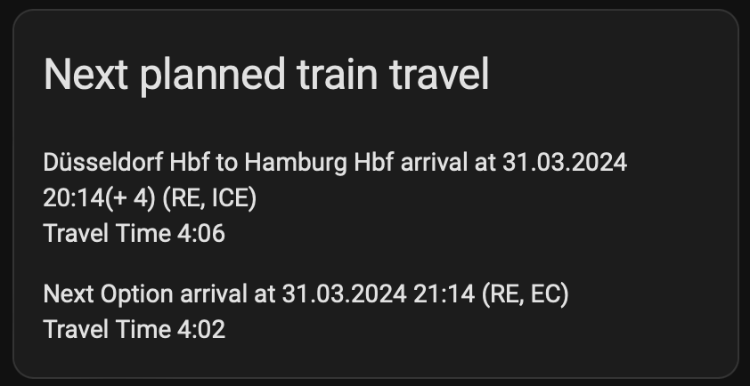

# DB Train Tracker for Home Assistant

A [Home Assistant](https://www.home-assistant.io/) extensions which uses the [schiene](https://github.com/kennell/schiene) library
to check for connections swithin the web portal of [Deutsche Bahn](https://www.bahn.de/) for calendar entries.

## Installation

    
Use <a href="https://hacs.xyz/">HACS</a> for installing the repository.

Once HACS is installed go to HACS and open the Hamburger menu and click "Custom Repositories".

Add under "Repository"

<ul>
    <li><code>cbrand/home-assistant-train-tracker</code></li>
</ul>
And under Category select `Integration`. Then click "Add".

Then you can install the plugin by searching for "DB Train Tracker".

## Usage

You can add a sensor which exposes the data for Connections which are in your calendar.

Add via the "Integrations Tab" under DB Train Tracker. There you can add the following entries:

- The list of calendars to track. These are all the calendars which are scanned for planned train travel times. The calendar must be imported in Home Assistant.
- The home station. If you do not have a departure set in your calendar this station is used as a starting point of your travel.
- The hours from now on the calendar is scanned for events which represent a planned time travel. Defaults to `48`.
- A list of [regular expressions](https://docs.python.org/3/library/re.html) which is used for scanning the subjects / titles of calendar entries for finding destinations of train travels and optionally departures. The feature uses named groups to track departure and arrival. For example `(?P<origin>.+)→(?P<destination>.+)` matches `Düsseldorf Hbf → Frankfurt Hbf` to point that Düsseldorf is the starting point and Frankfurt the end point of the travel. Multiple regular expressions can be provided by separating them with a `;`. The default settings are:
  - `Blocker[:]?[ ]*Travel[ ]*to(.+)`: Matches "Blocker: Travel to Berlin Hbf" for travel from your home station to Berlin Hbf.
  - `Train[ ]*Travel[ ]*to(.+)`: Matches "Train Travel to München Hbf" for travel from your home station to München Hbf.
  - `Train[ ]*Travel[ ]*from(?P<origin>.+) to(?P<destination>.+)`: Matches "Train Travel from Fulda Hbf to Wolfsburg Hbf" with the start of the travel being Fulda Hbf and the destination being Wolfsburg Hbf.
  - `(?P<origin>.+)→(?P<destination>.+)`: Matches "Stuttgart Hbf → Hamburg Hbf" with Stuttgart Hbf being the origin and Hamburg Hbf being the destination.
- An entry for mappings. Some stations might not fit in your calendar or it is implied what the station is by giving a short list. Your calendar could include "Train Travel to Berlin" implying "Berlin Hbf". This can be set by adding to the mappings list `Berlin,Berlin Hbf`. Which maps the word `Berlin` to `Berlin Hbf` before checking for connections between the stations. Multiple entries are allowed by separating them with a `;`.
- Maximum number of travel options to be returned per planned train travel in the sensor. Defaults to `5`.

This adds a sensor with attributes checking for the next time in which a train is departing in the provided time block and also returns
the next possible options of travel.

It can be for example utilized in a template to display when the next planned train travel.

    

        
    

This can be rendered with the following template. Make sure to adjust the sensor to the name which is including your home station.

    
    ~~{{state_attr("sensor.train_tracker_my_home_station", "origin")}} to {{state_attr("sensor.train_tracker_my_home_station", "destination")}} at {{as_timestamp(state_attr("sensor.train_tracker_my_home_station", "start")) | timestamp_custom('%d.%m.%Y %H:%M') }} (+ {{state_attr("sensor.train_tracker_my_home_station", "delay")}})arrival at {{ as_timestamp(state_attr("sensor.train_tracker_my_home_station", "end")) | timestamp_custom('%d.%m.%Y %H:%M') }}(+ {{state_attr("sensor.train_tracker_my_home_station", "arrival_delay")}}) ({{", ".join(state_attr("sensor.train_tracker_my_home_station", "products"))}})~~
    ~~Travel Time {{state_attr("sensor.train_tracker_my_home_station", "time")}}~~
    
    ~~Next Option at {{as_timestamp(state_attr("sensor.train_tracker_my_home_station", "next_start")) | timestamp_custom('%d.%m.%Y %H:%M') }} (+ {{state_attr("sensor.train_tracker_my_home_station", "next_delay")}})arrival at {{ as_timestamp(state_attr("sensor.train_tracker_my_home_station", "next_end")) | timestamp_custom('%d.%m.%Y %H:%M') }}(+ {{state_attr("sensor.train_tracker_my_home_station", "next_arrival_delay")}})  ({{", ".join(state_attr("sensor.train_tracker_my_home_station", "next_products"))}})~~
    ~~Travel Time {{state_attr("sensor.train_tracker_my_home_station", "next_time")}}~~
    
    Nothing Planned
    

